# Shadow Survivor

一款类吸血鬼幸存者的移动端竖屏 Roguelike 游戏。玩家选择不同职业的角色，在波次敌人中生存，通过升级获取技能加成强化自身。

## 主要玩法

### 角色系统

5 个可选角色，每个角色拥有独特的攻击方式和被动技能：

| 角色 | 攻击方式 | 被动技能 |
|------|---------|---------|
| 骑士 (Knight) | 近战AOE + 击退 | — |
| 弓手 (Archer) | 远程追踪箭 | 每20秒向四周发射穿透箭 |
| 法师 (Wizard) | 火球AOE爆炸 | 每20秒随机发射3颗火球 |
| 圣骑士 (Paladin) | 近战AOE + 击退 | 每60秒生成护盾 |
| 亡灵骑士 (DeadKnight) | 近战AOE + 击退 | 每60秒转化周围敌人为友方 |

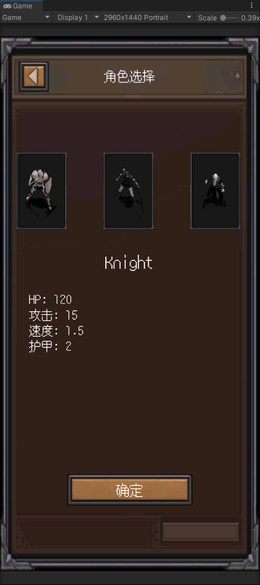

### 战斗系统

- **近战攻击**：范围检测 + 击退效果
- **远程攻击**：追踪弹 + 穿透机制
- **AOE攻击**：范围爆炸伤害
- **暴击系统**：暴击率 / 暴击伤害
- **On-hit 效果**：吸血、溅射、冰冻、眩晕、减速
- **生存效果**：闪避、格挡、无敌、伤害减免

| 近战攻击 | 远程攻击 |
|---------|---------|
| 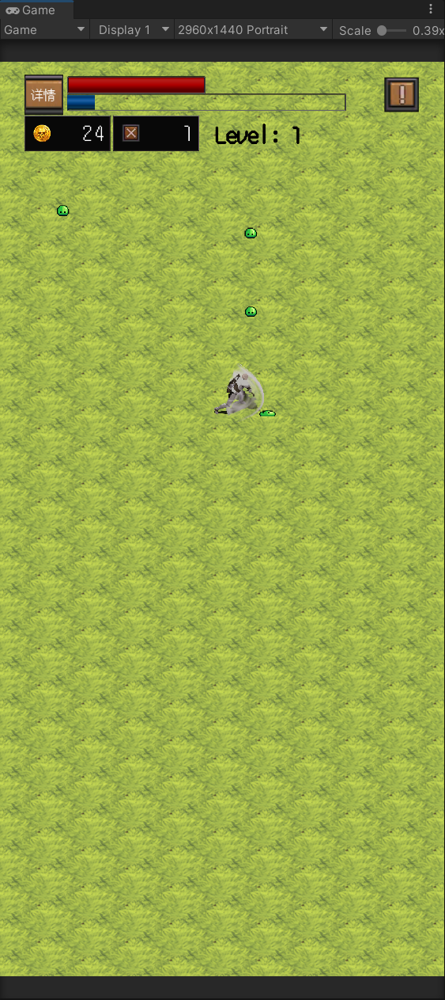 | 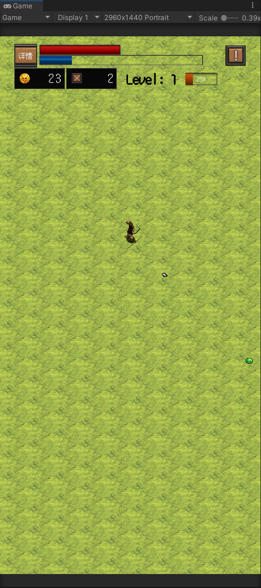 |

### 技能加成系统

升级时暂停游戏，从 3 个随机技能中选择 1 个：

- **43 个技能**，4 级稀有度（普通 50% / 稀有 35% / 史诗 10% / 传说 5%）
- **5 个分类**：属性加成、技能强化、特殊效果、生存效果、经济效果
- 相同技能可叠加升级，无等级上限

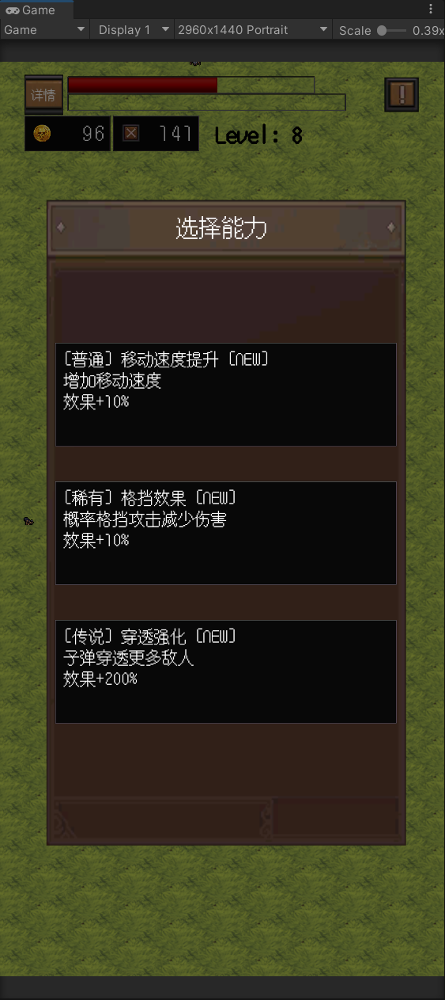

### 波次系统

10 波敌人，难度递增：

- 普通波次：击杀指定数量敌人后进入下一波
- BOSS 波次（第 5 / 10 波）：Dragon BOSS，拥有吐息攻击和起飞砸地技能
- 敌人属性随波次缩放（HP / 伤害倍率递增）

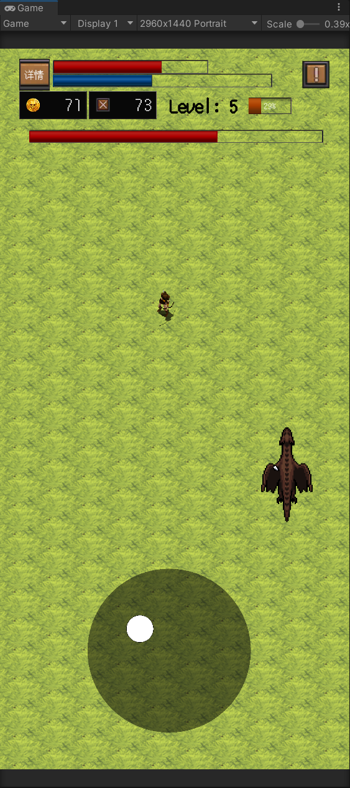

### 敌人系统

| 敌人 | 特点 |
|------|------|
| 史莱姆 | 基础近战 |
| 骷髅 | 中等近战 |
| 蜘蛛 | AOE冰冻攻击 |
| Dragon BOSS | 吐息(3发扇形) + 起飞砸地(AOE) + 无敌机制 |

敌人类型分层：普通敌人（可被 DeadKnight 转化）、精英敌人（不可转化）、BOSS（不可转化）

### 地图系统

等距地图程序化生成，Chunk 对象池管理，随玩家移动自动加载 / 卸载。

---

## 游戏截图

| 主界面 | 角色商店 |
|-------|---------|
| 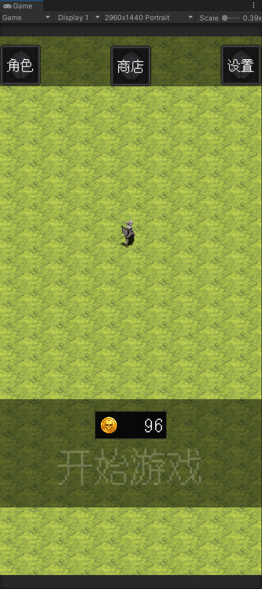 | 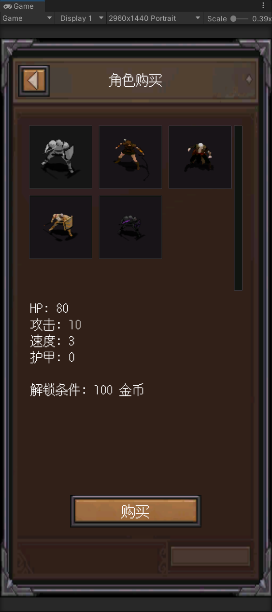 |

| 游戏中 | 玩家信息 |
|-------|---------|
| 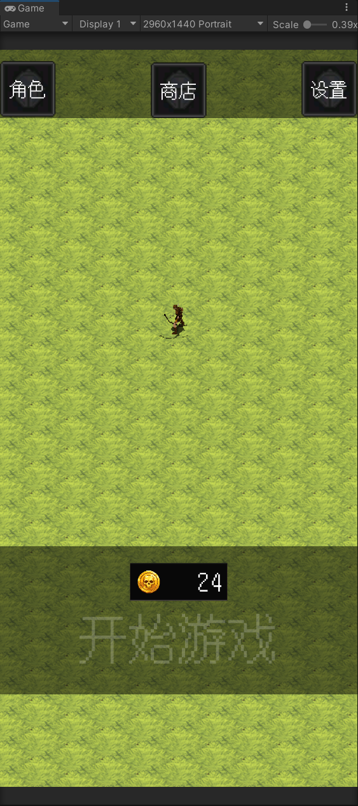 | 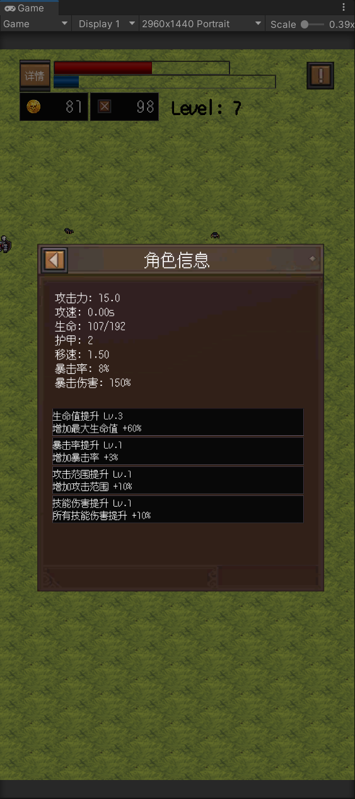 |

| 设置 | 角色商店详情 |
|-----|------------|
| 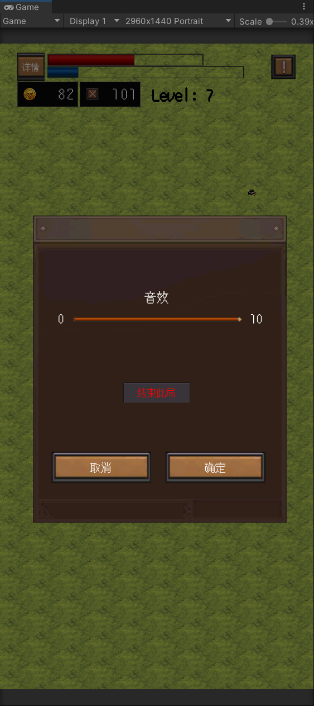 | 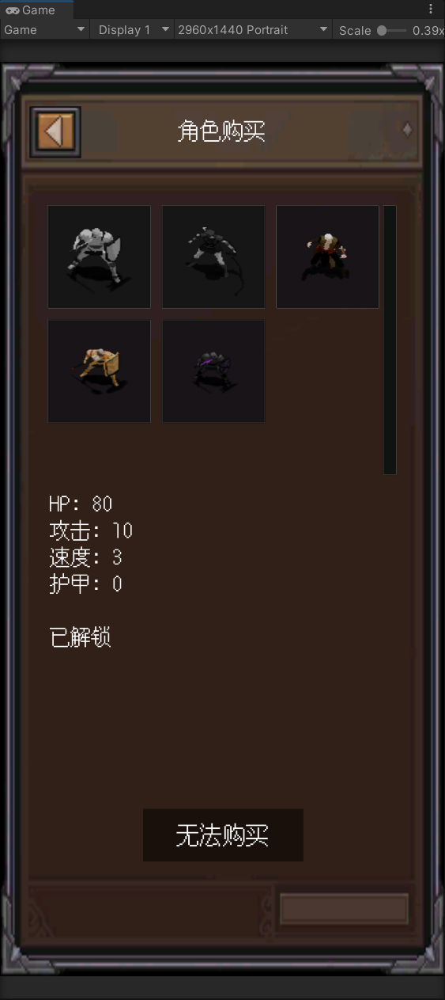 |

---

## 技术实现

### 架构设计

```
Scripts/
├── Core/
│   ├── Singleton/          # 单例基类 (SingleBase / SingleBaseMono)
│   ├── StateMachine/       # 状态机 (IState → CharacterState<T> → 具体状态)
│   ├── MoMs/               # 管理器 (GameManager / PoolManager / WaveManager / MapGenerator / UIManager)
│   ├── GameEvents.cs       # 事件系统 (Action 委托发布/订阅)
│   ├── BuffSystem.cs       # 增益系统 (速度/伤害/护甲/DOT)
│   └── SkillEffectApplier.cs # 技能效果应用器
├── Character/
│   ├── Character.cs        # 角色基类 (动画/物理/渲染排序/受击特效)
│   ├── Player/             # 5个玩家角色 + 攻击状态 + 被动技能
│   └── Enemy/              # 敌人基类 + AI状态 + 子类(Normal/Elite/Boss)
├── Data/                   # 数据模型 + JSON配置
├── UI/
│   ├── All/                # FGUI 自动生成的 View 层
│   └── Controller/         # 手写的 Controller 层
└── Data/                   # JSON 配置文件
```

### 核心设计模式

| 模式 | 应用 |
|------|------|
| **状态机** | 游戏状态 (Menu/Playing/Paused/GameOver)、角色 AI、角色攻击状态 |
| **对象池** | 敌人、投射物、特效、地图块的复用 |
| **观察者** | GameEvents 事件驱动 UI 更新 |
| **MVC 组合** | FGUI View (UI/All/) + Controller (UI/Controller/)，UIManager 泛型管理 |
| **策略** | 不同角色的攻击行为、敌人 AI 行为 |
| **数据驱动** | 所有配置通过 JSON + LitJson 加载 |

### 性能优化

- 对象池化（敌人 / 投射物 / 特效 / 地图块）
- 事件驱动 UI（避免轮询）
- Chunk 地图加载（视距裁剪）
- 等距瓦片渲染排序

### 关键系统

- **统一伤害出口**：`Player.DealDamageToEnemy()` 集中处理暴击、加成、on-hit 效果
- **BuffSystem**：独立增益管理，支持速度/伤害/护甲/DOT
- **转化系统**：DeadKnight 被动将敌人转为友方，AI 目标选择动态切换
- **BOSS 状态机**：独立于普通敌人的 Chase/Breath/LiftOff/Landing 状态
- **技能加成系统**：43 个技能、4 级稀有度、升级叠加、效果自动对接

---

## 技术栈

- **引擎**：Unity 2022 LTS
- **UI 框架**：FairyGUI
- **数据格式**：JSON + LitJson
- **目标平台**：移动端竖屏

---

## 项目结构

```
Assets/
├── Animations/          # 动画控制器 + 动画片段
├── FairyGUI/            # FairyGUI SDK
├── Resources/
│   ├── Data/            # JSON 配置文件
│   ├── Materials/       # 材质 (受击/冰冻/晕眩特效)
│   ├── Prefabs/         # 预设体 (玩家/敌人/投射物)
│   └── Sprites/         # 精灵图 (角色/敌人/地图/UI)
├── Scripts/             # C# 脚本
└── UI/                  # FairyGUI 编辑器资源
```
